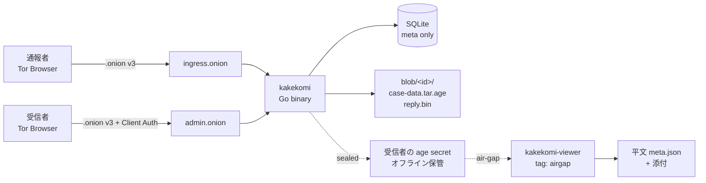

<div align="center">

# kakekomi

### 個人/小規模向け 軽量 SecureDrop 代替

[](https://go.dev/)
[](https://www.torproject.org/)
[](https://age-encryption.org/)
[](LICENSE)
[](#-警告)

**個人ジャーナリスト / 弁護士 / 監査人が 30 分で自前の匿名通報窓口を立てるための Go 単一バイナリ製 OSS。**

---

</div>

## ⚠️ 警告

**本ソフトウェアは EXPERIMENTAL です。第三者セキュリティ監査を受けていません。命や職に関わる用途では使わないでください。** 本家 [SecureDrop](https://securedrop.org/) は air-gapped viewing station と Tails OS 統合を含む包括的な仕組みです。本プロジェクトはそれよりも軽量な代替であり、**スレットモデルが異なります**。`THREAT_MODEL.md` を必ず読んでから運用してください。

## 概要

匿名通報者がジャーナリスト/弁護士に Tor Hidden Service v3 経由で情報を送るための窓口。受信者は手元のサーバで `kakekomi init` → `kakekomi run` するだけで自前の `.onion` を立てられる。受信内容は age + ChaCha20-Poly1305 で暗号化された状態でディスクに書かれ、サーバが押収されても **受信者の秘密鍵がオフライン保管されていれば平文は読まれない**。返信はコードから派生する対称鍵で暗号化されるため、受信者の秘密鍵を持たないサーバ運営者は返信も復号できない。

| 設計上のコア性質 | 仕組み |
|---|---|
| 通報内容の機密性 | age envelope encryption。受信者の秘密鍵はサーバに置かない |
| 通報者の匿名性 | Tor Hidden Service v3 ingress、JavaScript 完全不使用、Cookie・LocalStorage 一切残さない |
| 受信者→通報者の返信 | `HKDF-SHA256(code, case_id, "kakekomi/v1/reply-key")` で派生した XChaCha20-Poly1305 鍵で暗号化 |
| サーバ押収時の防御 | secrets.age (argon2id master_key で暗号化) + duress TOTP による即時 shred |
| DoS 抑制 | サーバ側ハッシュチェーン PoW (ブラウザ JS 不要) + Tor 0.4.8+ の IntroDoSDefense / PoW |
| メタデータ除去 | 添付は画像と plain text のみ、画像は decode → encode で再エンコード (EXIF/XMP/ICC 除去) |
| タイミング攻撃対策 | `/submit` `/reply` `/admin/login` に固定 wait floor、`/reply` は HMAC indexed lookup で件数非依存 |
| 反フィンガープリント | JS ゼロ、Web フォント禁止、`Accept-Language` 無視、timestamp を 1 時間粒度に丸めて保存 |

## 特徴

| カテゴリ | 内容 |
|---|---|
| バイナリ | 単一 Go バイナリ (CGO 不要)、pure Go SQLite |
| Tor 統合 | 外部 `tor` の control port 経由で `.onion v3` を動的発行、Client Auth 対応 |
| 設定 | フォーム項目は YAML で自由定義、デフォルトは body 以外全て optional |
| 通報コード | BIP39 7 単語 (~77 bit entropy) + argon2id 検証 |
| 添付 | 画像 (jpg/png/webp/gif) と plain text、再エンコードで PRNU 緩和 |
| 受信者管理画面 | 別 `.onion` (Client Auth)、パスワード + TOTP、CSRF double-submit token、15 分 idle 失効 |
| Duress TOTP | 強制ログイン時に第二の TOTP を入力すると全 case を shred + DB VACUUM、画面は通常失敗と区別不能 |
| 復号 | サーバ上で **絶対に復号しない**。手元の air-gap 端末で `kakekomi-viewer decrypt` (build tag `airgap` で `net` 排除) |
| ライセンス | AGPL-3.0 (SaaS 化による囲い込み防止) |

## 構成



## クイックスタート

### 必要なもの
- Go 1.25 以上
- (任意) 外部 `tor` 0.4.8+ — 本番運用で `.onion` を出すなら必須

### ビルド
```bash
go build -trimpath -ldflags="-s -w -buildid=" -o kakekomi ./cmd/kakekomi
go build -trimpath -tags airgap -ldflags="-s -w -buildid=" -o kakekomi-viewer ./cmd/viewer
```

### 初期化
```bash
./kakekomi init --data-dir ./data
# プロンプトに従って:
#   - 受信者パスフレーズ (12 文字以上、secrets.age の暗号化に使う)
#   - 管理ログイン用パスワード
# 出力で 1 度だけ表示される情報を必ず保管:
#   - 受信者の age 秘密鍵  (これが無いと通報を復号できない)
#   - 通常 TOTP の Secret  (認証アプリに登録)
#   - Duress TOTP の Secret (別の機器で別ラベル管理 — 強制開示時の wipe トリガー)
```

### 起動
```bash
./kakekomi run --data-dir ./data --addr 127.0.0.1:8080
# stdin に init で設定したパスフレーズを入力
```
ブラウザで http://127.0.0.1:8080/ にアクセスすると通報フォーム、`/admin/login` から受信者ダッシュボード。

### Tor 統合
`config/kakekomi.yaml` で `tor.enabled: true` にし、外部 `tor` (control port = 9051 を expose) を起動した状態で `kakekomi run` すると `.onion` が動的発行される。詳細は `deploy/tor/torrc.example` 参照。

### 復号 (受信者の手元の air-gap 端末で)
```bash
# admin ダッシュボードから .tar.age.kkk を DL し、USB 等で air-gap 端末に移動
./kakekomi-viewer decrypt --identity secret.txt --in case-XXXX.tar.age.kkk --out ./out
# 展開先 ./out/meta.json + ./out/attachments/ を確認
```

## CLI

| コマンド | 用途 |
|---|---|
| `kakekomi init` | age 鍵生成 + パスフレーズ設定 + admin password + TOTP (normal+duress) + config 雛形 |
| `kakekomi run` | stdin からパスフレーズ → secrets 復号 → HTTP server 起動 |
| `kakekomi gc` | TTL 切れ case の sweep (cron 用、起動時と 1 時間ごとにも自動実行) |
| `kakekomi rotate-key` | 受信者 age 鍵をローテート (旧鍵は過去通報の復号に必要なのでオフライン保管継続) |
| `kakekomi config validate` | YAML config の構文 + 論理検証 |
| `kakekomi-viewer decrypt` | air-gap 端末で blob を復号 + tar 展開 |

## 設計ドキュメント

| ファイル | 内容 |
|---|---|
| [`THREAT_MODEL.md`](THREAT_MODEL.md) | 想定する敵 (A1-A6) / TCB / 残余リスク / 非目標 |
| [`ARCHITECTURE.md`](ARCHITECTURE.md) | システム図 / 鍵設計 (二層: age + HKDF) / データフロー / 設定仕様 |
| [`SPEC.md`](SPEC.md) | 機能要件 (MUST/SHOULD/MAY/MUST NOT 番号付き) / UI 仕様 / 開発フェーズ |
| [`HARDENING.md`](HARDENING.md) | L0 暗号〜L9 反フィンガープリントの多層防御 + 運用チェックリスト |
| [`deploy/systemd/kakekomi.service`](deploy/systemd/kakekomi.service) | systemd ハードン unit (DynamicUser / SystemCallFilter / IPAddressDeny 他) |
| [`deploy/tor/torrc.example`](deploy/tor/torrc.example) | vanguards-lite + IntroDoSDefense + PoWDefenses 込みの torrc |
| [`deploy/docker/Dockerfile`](deploy/docker/Dockerfile) | distroless/static + nonroot のマルチステージ |
| [`examples/kakekomi.example.yaml`](examples/kakekomi.example.yaml) | カスタマイズ可能なフォーム項目のサンプル |

## 既知の限界 (公開前から認識している箇所)

| 重大度 | 内容 |
|---|---|
| 高 | **第三者監査未実施**。命に関わる用途では使うべきでない。`v1.0.0` を切るのは外部監査受領後。 |
| 中 | Tor 統合は実装済みだが、本リポジトリでは実機 Tor を起動した実環境エンドツーエンドのテストを通していない (control client は単体で書いた)。 |
| 中 | ユニットテスト / 統合テスト / ファズテスト未整備。回帰検出は手動 E2E に依存している。 |
| 中 | `mlock` / `memguard` の利用は `SecureBuffer` ヘルパだけで、コード全体で完全には敷き詰めていない。 |
| 低 | 添付に HEIC は受け付けない (pure-Go 復号器が無く、メタ除去できないため)。iPhone ユーザは JPEG/PNG に変換してから投稿が必要。 |
| 低 | Web フロントエンドは強制的に固定テーマ・JS ゼロ。これは指紋低減のため意図的。 |
| 低 | Duress TOTP の wipe は SSD wear-leveling 層の残データ消去までは保証しない。フルディスク暗号化 (LUKS/BitLocker) を前提とする。 |

詳細は `SPEC.md` §9 (開発フェーズ) と `HARDENING.md` を参照してください。

## セキュリティ報告

脆弱性を見つけた場合、公開 issue ではなく **GPG 暗号化メール** で連絡をお願いします。連絡先は近日中に `.well-known/security.txt` を整備します。

## ライセンス

[GNU AGPL-3.0](LICENSE)

本ソフトウェアを改変してネットワーク経由で第三者に提供する場合、その改変版のソースコードも AGPL-3.0 で公開する義務があります。SaaS 化による囲い込みを防ぐ目的です。
